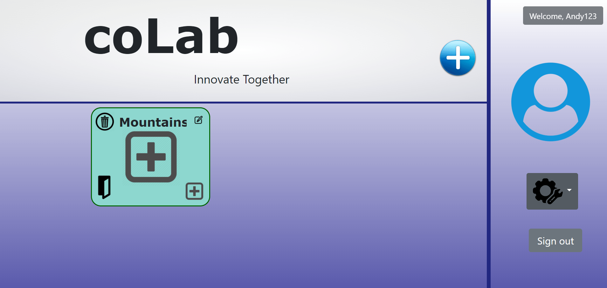
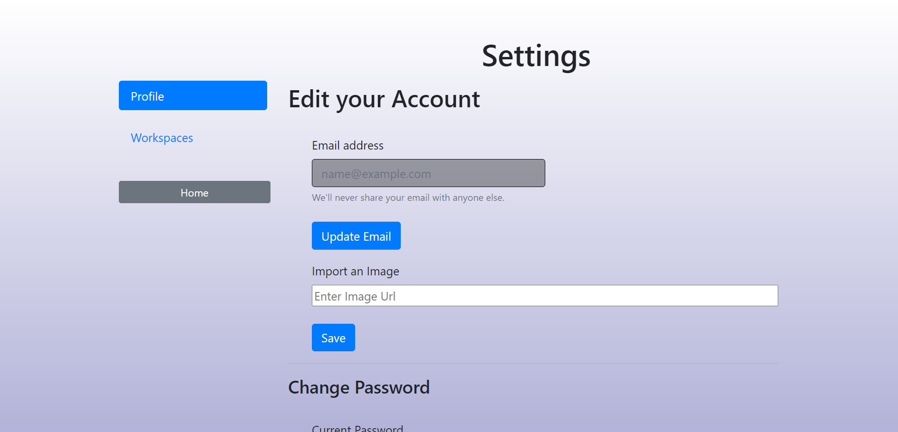
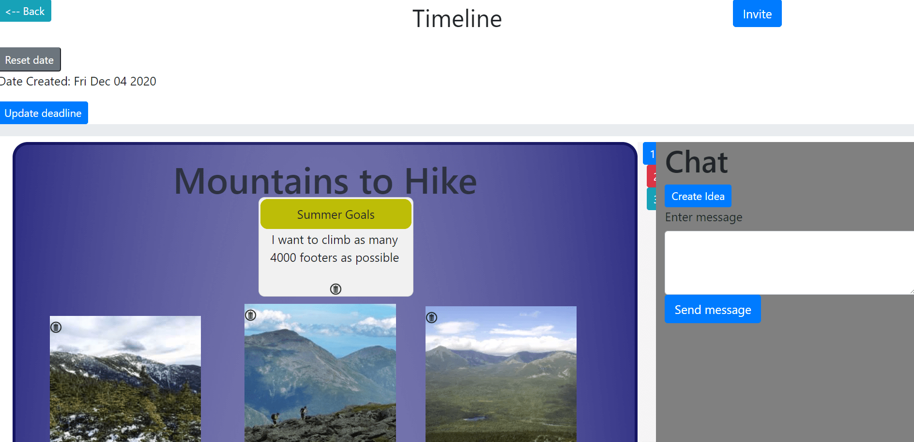
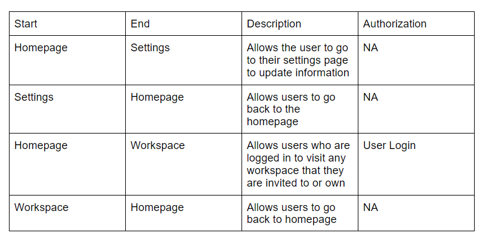

Title: Alef

Subtitle: CoLAb

Semester: Fall 2020

Description

This website allows people to make planning spaces for various projects, which are areas where you can individualize the needs of the space. Each space within a project would have a goal, for example: food to eat, things to do, people to invite, and presents to give. You can invite other people to contribute to the space, and who you invite can be personalized to each specific space. For example, you can invite all participants, just the people part of planning that specific part, just one other person, or any other combination of people you’d like. Within each workspace, you can create sticky notes, insert/share images, vote on ideas, and even chat with the users invited to that workspace. 

Another key aspect of this website is that users are able to communicate with one another through the use of the messaging system within the workspace. All users invited to a workspace are able to communicate within the workspace. Multiple people can work in a space at the same time, which can act as a planning station or an area for idea maps. Similar to a Google Doc to the idea of allowing people to work on the same project, but graphical and focused on a goal with potential components.

Team Members:

Andrew Howard, athoward1

Luis Merida, 17lmerida

Olin Goudey, OlinGoudey

User Interface:

On the homepage, users can login or sign up with a button in the top right corner of the screen. They are prompted with a form with username and password to type in or they can click on the sign up tab where they can create a new account. After creating an account a user can now create a new workspace with a big plus button on the homepage. When a workspace is created, they can name the workspace, edit the picture, delete it, or enter into the workspace. 

On the settings page, a user can create an email address associated with the account, as well as put in their first name, last name, change their password, set the region of where they are from, and delete their account if they wanted. They can also set a profile picture that will show on the homepage. In the settings page there is a tab for workspaces where the user can see the workspaces that they own and are shared to. 

On the workspace page, a user can start off by setting a deadline in the project with any date and the timeline bar will show the time left until the deadline. Next the user can invite other users to their workspace by pressing the invite button in the top right corner. There is a drop down where they can enter another user's username. There is also a button to create a sticky note on the workspace, where the user can set the title and body of the sticky note. The sticky note will show up on the workspace where it's saved until deleted and the user can move the sticky note around. If hovered over the sticky note, the author's name will show up. The second button will give the user an option to create an image by entering its image URL. The image will pop up on the homepage where the user can move it around. Another feature of the workspace is the chatting. There is a chatting panel on the right side where users can chat with each other. They can also create an idea where they add the idea name and number of tasks it would take to complete it, as well as the description of the idea. If a user creates an idea, other users can vote on the idea and approve it. The navigation back to the homepage is in the top right corner.

APIs: A final up-to-date list/table describing your application’s API

    getStickies{userid: String, workspaceid: String}
    
    getSharedToUser{
        user: String
    }
    
    addChat{
        userid:String,
            workspaceid:String,
            header: Object,
            text: String,
            dateSent: String
    }
    
    addNewShare{userid: String, workspaceid: String, invite: String}
    
    getImages{userid:String, workspaceid: String}
    
    deleteSticky{userid: String, workspaceid: String, header: Object, body: Object}
    
    sendSticky{userid:String, 
                workspaceid:String,
                header: Object,
                text: String,
                dateSent: String}
                
    createSticky{userid:String,
              workspaceid:String,
              header: Object,
              body: Object,
              positions: Object}
              
    createImage{userid: String, workspaceid: String, image_url: String, positions: Object}
    
    updateStickyPosition{workspaceid:String, header:Object, body:Object, positions:Object}
    
    updateImagePosition{workspaceid:String,
                    image_url: String,
                    positions: Object}
    
    createAccount{username: String, password: String}
    
    createSettings{username:String}
    
    login{username: String, password: String}
    
    getWorkspaceInfo{userid: String}
    
    getWorkspaceUnderUser{
        userid: String
    }
    
    getUserInfo{userid: String}
    
    newWorkspace{userid:String,
                workspaceid:String,
                chatid:String,
                plannerid:String,
                taskid:String,
                timelineid:String,
                title: String,
                image_url:String}
                
    unvinviteAll{userid: String, title: String}
    
    deleteWorkspace{userid: String, workspaceid: String}
    
    checkUniqueWorkspaceName{userid: String,
                        newworkspaceid: String}
                        
    updateWorkspaceTitle{userid: String,
                        workspaceid: String,
                        newworkspaceid: String}
                        
    updateWorkspaceImage{userid: String,
                        workspaceid: String,
                        image_url: String}
                        
    changeProfPic{username: String,
                image_url: String}
                
    changePassword{username: String, password: String}
    
    updateEmail{userid: String, value: String}
    
    updateFirstName{userid: String,
                value: String}
                
    updateLastName{userid: String, value: String}
    
    updateRegion{userid: String, value: String}
    
    shared{userid: String, title: String}
    
    uninvite{userid: String, title: String, shared: String}

Database:

We had a total of 7 tables in our Heroku database. We created each with separation and ease-of-use in mind. While we could have overlapped the data, by putting more arrays in the values, we figured it would be syntactically more convenient if things were just text keys.

In the table called LOGINS, we store the login information: a (unique) username, and the authentication data, which includes salt and hash.
 
Next, all settings information is under USERINFO, and has personal information according to each unique username. The values of this table are in the form (username, image_url, email, firstname, lastname, country).
 
The WORKSPACEINFO table keeps track of which users are shared with which workspace, in the form (owner, workspaceid, shared). This is used for inviting other users to the workspace, and loading workspaces that are shared with you on the homepage. Also, from the settings page, this table is requested from to display all the information about the users you have shared a workspace with.
 
The workspace data of each workspace is stored in a table called WORKSPACES, that distinguishes uniqueness differently depending on the use. When loading all the workspaces, the table returns all the workspaces owned by the user. Otherwise, the data in this table are the image_url and title, edited from the homepage. In that case, the data is accessed by the unique and random workspaceID.
 
The specific data in the workspaces comes in two parts, the Stickies, and the Images. Therefore there are two tables: STICKYDATA, in which each sticky has its author’s name, the workspace’s ID of which it belongs to, the content in the form of the header and pody, and lastly the position in the workspace. These attributes are accessed by the workspaceID and distinguished by their content.
 
The IMAGEDATA is a table of similar attributes, but instead of by content, it is by a unique imageID that they are distinguished. 
 
The final CHAT table keeps track of the chat data corresponding to each workspace, accessed again by the workspaceID. The values in this table are (userid, header, text, datesent).

URL Routes/Mappings: 

Authentication/Authorization: 

Users are authenticated when they login or create an account. Users will only see workspaces that they own or are invited to. Permissions to work on other peoples workspaces are allowed when users are invited by their usernames from the specific workspace.

Division of Labor: 

Andrew Howard - Added moveable sticky notes and images, Invite button and layout of homepage and settings page.

Luis Merida - Added text chat, created timeline, idea creation  and endpoints to save chat, added styles to the html elements.

Olin Goudey - 
	Did most of the endpoints; the sharing and displaying on homepage; login/logout and guest feature; workspace page in settings; various css.

Conclusion: 
Throughout this project we learned a lot about javascript, html, css. We used everything we learned from the course and then learned some more on our own. One of the biggest things that we learned was to use github as a group. We had some troubles merging branches together smoothly and finding ways to push branches to heroku. Another piece of information that we learned through the design and implementation process was implementing a database and saving users information. This was one of the most valuable experiences that we gained and will utilize this knowledge in the future to create web sites that are dynamic, can handle multiple users, store as well as retrieve data, and keep user login information safe. 
