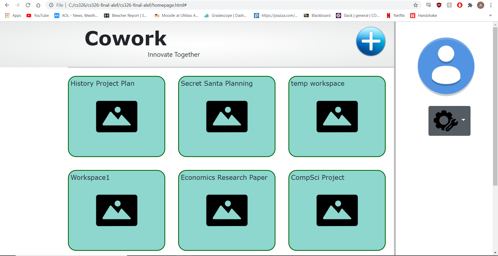
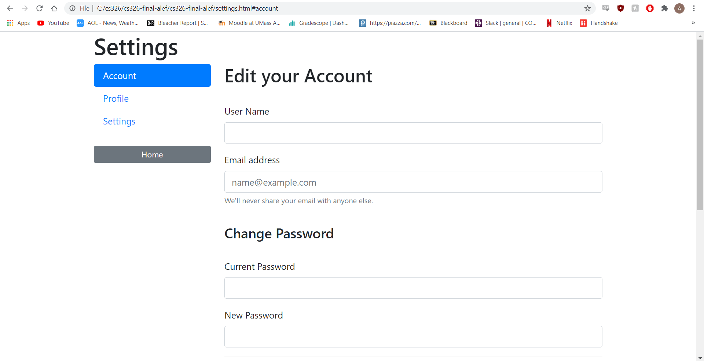
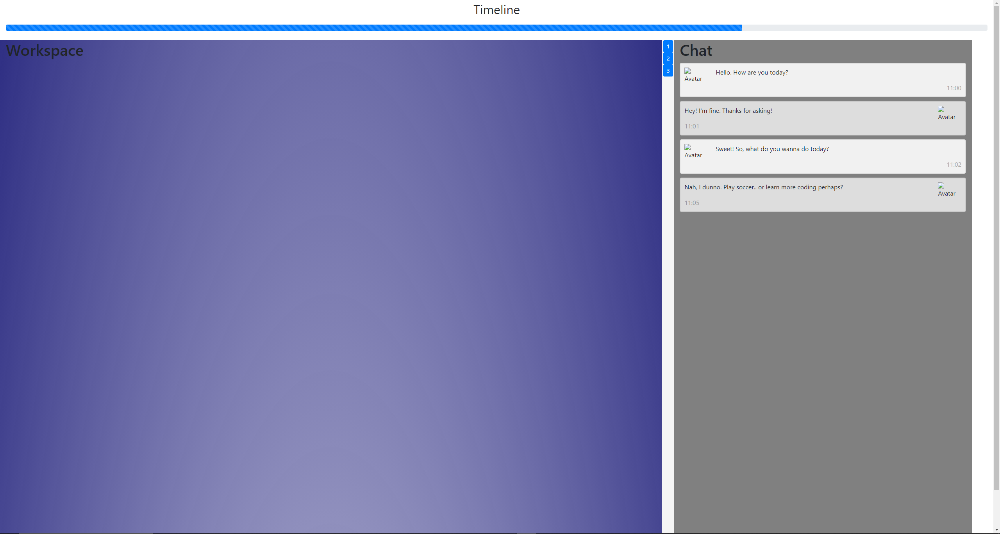

1. Alef
2. Collaborative Planning Station
3. Team Overview
    Olin Goudey - OlinGoudey
        Luis Merida - 17lmerida
        Andrew Howard - athoward1
4. Innovative Idea
    A website that allows people to make planning spaces, basically some visualized 2D space. The spaces would each have a goal: food to eat, things to do, people to invite, and presents to give. You can invite other people to contribute (e.g. invite all but the present-receiver, or just the adults, or just the hosts, or just one other person). Many ways to layout the spaces but big graphs with terminal/nonterminal ideas and potential subgraphs for them. Multiple people would be working on it at the same time, which would act as a planning station or idea maps. Similar to a Google Doc, but graphical and focused on a goal with potential components.
5. Important Components
    MakeGrid() Function- This function will be the backbone of the entire project given the layout of the webpage.
    Live collaboration- The main motivation of this project is collaboration within a given workspace between team members at the same time 
    Hash Authentication: Given the core motivation of the project, security is key, so we will try and implement a system to verify a users’ status to give each planning space a hierarchical user system. 
    Pleasant visuals- Since another main component of the project is creating graphs for the user to see it will be important to create a UI system that is complex but easy to understand.  
    Editing cells- Another important component of this project will be the handling  of making and editing cells within the workspace
    Save state- This will save the state of the workspace
    Load state- Will do the opposite of save state
5. Data Interactions:
	For the workspaces:
	    Users will be able to communicate with one another through the use of the messaging system in the workspace. Users will need to join a single workspace for communication. Users will see others working and moving elements in the same workspace. Each user has their own account information and profile stored in the servers files. There is some voting data also being used when users will vote on ideas in the workspace.
6. Division of Labor
    Luis Merida - Created and designed workspace.html. Created workspace and homepage on wireframe.
    Olin Goudey - Created skeleton of workspace.html, workspace.css and workspace.js. Added style settings to settings.css
    Andrew Howard - Created homepage.html, homepage.css, settings.html, and homepage.css. Also added the settings page to the wireframe.
    

#### Homepage
Homepage allows you to see your already made workspaces aswell as create new ones. It provides links to your workspaces, account, and settings. You can see your customized profile icon and workspace icons.

#### Settings
Settings page allows users to change account information, profile information, and settings that correspond to the workspace.

#### Workspace
Workspace gives a interactive and collaborative to work on projects with multiple people. It has a chat - the portion of the workspace that allows the users to communicate and make changes to the planner. Users can like or submit/vote on ideas easily, "good" ideas will move to good ideas section. It also has a planner - this will be where the users will collaboratively plan out their choice of event. It has a timeline - A chronological timeline where users place "milestones". Milestones are important dates relating to each project, users will be reminded of near-by milestones and can mouse over each milestone to see its related elements. The workspace allows for the use of elements which are a list of required tasks that the user can click to see more information about the task such as, when it is due and where in the timeline is it due, other elements that are dependent on it/it depends on, what they relate to one planner(lines connecting to ares of the planner). Elements can be organized by what color dot they are, colors will relate to categories made by the user. 

