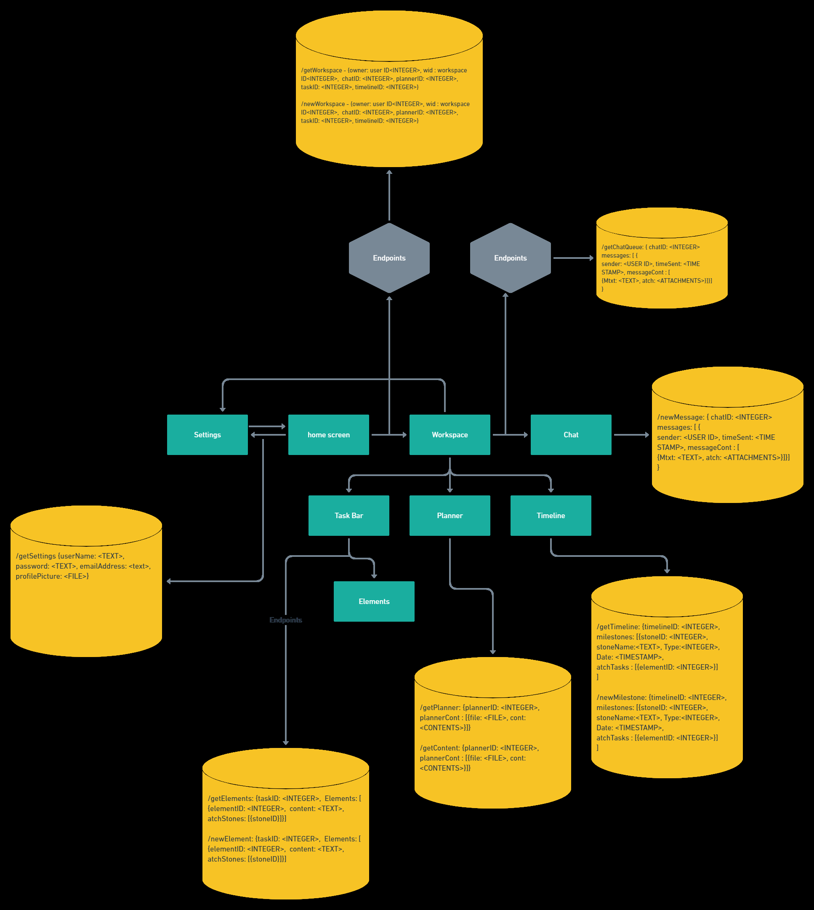

Division of Labor:

Luis Merida:Created the representation of API's using whimsical.

Andrew Howard:Created dummy server. Created interactions on homepage with adding/editing/deleting new workspaces and saving login information. Added onto api representation. 
                  
Olin Goudey:Created the heroku app.

1. A brief and precise representation of APIs for our application

2. Create:Create a new login  

   Update:Update a workspaces name  
   
   Delete: Delete a workspace. Click the trashcan Icon in the top right and it deletes the workspace. 
   
   Read: Read if the name is in the servers files.  
   
   

3. URL of Heroku App: https://cs326-alef.herokuapp.com/